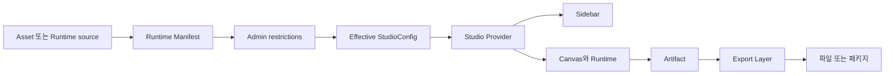

# Studio

이 문서는 Template·Graphic·Image·Graph Studio가 같은 계약으로 설정을 만들고, 화면을 조작하며, 파일을 내보내는 흐름을 설명합니다. 새 Runtime이나 출력 형식을 추가할 때 어느 레이어를 수정해야 하는지 판단하는 기준으로 사용합니다.

## 1. 목적

네 Studio는 만드는 대상이 다르지만 아래 원칙을 공유합니다.

- Runtime Manifest가 원본 capability를 정의합니다.
- Admin은 capability를 추가하지 않고 제한합니다.
- Studio UI는 계산이 끝난 Effective Config만 소비합니다.
- Runtime은 파일 형식이 아니라 Artifact를 만듭니다.
- Export Layer가 Artifact를 파일로 변환합니다.

이 구조는 Admin·Sidebar·Canvas·Exporter가 같은 규칙을 다시 구현하지 않게 합니다. 각 레이어는 바로 앞 레이어의 결과만 소비합니다.

## 2. 핵심 계약

### 전체 흐름



데이터는 왼쪽에서 오른쪽으로 흐릅니다. Sidebar와 Canvas는 서로를 import하거나 직접 호출하지 않습니다. 둘은 Studio Provider가 발행한 Context만 소비합니다.

### Runtime Manifest

`StudioRuntimeManifest`는 Admin 제한 전의 원본 계약입니다.

```ts
type StudioRuntimeManifest = {
	artifacts: StudioArtifactCapabilities
	controller: {
		groups: readonly ControllerGroupDefinition[]
		left?: readonly string[]
		right?: readonly string[]
		remountOn?: readonly string[]
	}
}
```

Manifest는 다음 두 가지를 정의합니다.

- Runtime이 만들 수 있는 `raster | vector | video | original` Artifact
- Controller가 표시할 그룹, 컨트롤 종류, 기본값과 허용 범위

Manifest는 파일 형식을 정의하지 않습니다. 같은 입력에서 항상 같은 결과를 내는 직렬화 가능한 값이어야 합니다.

네 Studio는 서로 다른 원본에서 Manifest를 만듭니다.

| Studio | Manifest 원본 | 파생 함수 |
| --- | --- | --- |
| Graphic | Drop-in Graphic Runtime definition | `defineGraphicRuntime()` |
| Graph | Drop-in Graph Runtime definition | `defineGraphicRuntime()` |
| Image | Generation Model capability | `getImageRuntimeManifest()` |
| Template | published HTML과 `nodeConfigs` | `getTemplateRuntimeManifest()` |

### 캔버스 스튜디오 둘 — Graphic과 Graph

Graphic과 Graph는 **실행 계약이 한 벌입니다**(`CANVAS_STUDIO_KINDS`). Manifest·Controller·Artifact·Export가 같은 규칙을 타고, 파생 로직도 `canvas-studio-manifest.ts` 하나를 공유합니다. 갈리는 것은 둘뿐입니다.

| 갈리는 것 | Graphic | Graph |
| --- | --- | --- |
| 런타임 카탈로그 | `graphic-generation/graphic-runtimes` | `graph-generation/graph-runtimes` |
| 프로파일 컬렉션 | `graphic-profiles` | `graph-profiles` |

🔴 카탈로그를 합치면 Graph 화면에서 Graphic 런타임이 열리고, 컬렉션을 합치면 admin 목록이 섞이며 한쪽 런타임을 더할 때 상대의 enum 마이그레이션이 따라옵니다. 그래서 이 둘만 가릅니다. 새 캔버스 스튜디오를 세울 때 필요한 것도 이 둘과 라우트·API뿐이고, 카탈로그는 `scripts/generate-graphic-runtime-catalogs.ts`의 `CATALOG_TARGETS`에 한 줄을 더하면 생성됩니다.

### Admin restrictions

Admin은 Manifest를 읽고 다음 두 공통 정책을 저장합니다(Template은 첫 정책 대신 배경(`backgroundPolicy`)과 레이어별 `overrides[nodeId]`를 저장합니다).

- `controllerRestrictions`: availability, 기본값, 선택지, 길이와 범위를 좁힙니다.
- `exportPolicy`: 파일 형식, 원본 허용 여부, FPS, 크기와 길이 상한을 좁힙니다. 인쇄 해상도만 예외입니다 — `print.allowedPpi`는 범위를 좁히는 목록이 아니라 화면 드롭다운의 **프리셋 목록을 대신하는 값**이며(`narrowPrintPpi`), 프리셋 밖의 값도 담을 수 있습니다. 유효성은 `acceptsPrintPpi()`가 `isPrintPpi()` 범위(1~1200 정수)로 판정합니다.

### 창작자에게 보여줄 축 — 패널 컴포지션

Runtime Manifest는 컨트롤마다 **무엇을 뜻하나(역할)**와 **어떤 위젯으로 함께 서나(묶음)**만 선언하고, 자리는 스튜디오 패널의 정책이 정합니다. 계약 전문은 `docs/10-component-authoring.md` §3.7이 소유합니다.

| 층 | 선언 | 자리 | 기대 |
| --- | --- | --- | --- |
| 묶음·큰 역할 | `controller.clusters`, `palette`·`form`·`placement`·`source` | Basic | 색 조합·큰 형태처럼 **창작자가 실제로 다루는** 축 |
| `tuning` | `controller.roles` | Adjustment | 세기·두께·속도 같은 잔 축 — 다룰 수는 있다 |
| 미선언 | 역할도 묶음도 없음 | 없음 | manager가 Payload에서만 |

- 가르는 기준은 **창작자가 바꿀 수 있어야 하는 축인가**입니다. 색, 모양, 속도, 위치처럼 직관적이고 변화폭이 큰 것만 남깁니다. 세부 광선·유리 물성처럼 값을 봐도 결과를 알 수 없는 축은 기본값으로 둡니다.
- 🔑 속도는 축 하나입니다. `speed`가 마스터 시계라(`iTime * uGodraySpeed`) 나머지 속도가 그렇게 스케일된 시간을 곱하므로, 이 하나가 모든 움직임을 함께 늘리고 줄입니다.
- 🔴 **`roles`·`clusters`를 하나도 선언하지 않은 런타임은 전부 Basic에 섭니다.** 정하지 않은 런타임의 화면이 비지 않게 합니다(지금 Graph 인포그래픽이 이 경우입니다). Graphic 런타임은 모두 묶음을 선언하고, 테스트가 그것을 지킵니다.
- 🔴 **컨트롤 선언 자체를 지우지 않습니다.** 창작자에게 감추더라도 manager는 Payload에서 그 값을 조정할 수 있어야 하고, 선언이 사라지면 그 경로도 함께 사라집니다. 셰이더 변환기가 기본 입력을 깔고 컨트롤 값으로만 덮으므로, 선언을 남긴 채 역할만 빼면 값은 정본 기본값을 따릅니다.
- 없는 control id를 역할·묶음 멤버에 적으면 설정 파싱이 거부합니다. 오타 하나가 「컨트롤이 이유 없이 사라진 것」으로만 보이지 않게 합니다.
- `controllerRestrictions`와 독립입니다. 제한은 **만질 수 있는지**를, 이 선언은 **화면에 서는지**를 정합니다. 제한은 컨트롤을 없애지 않으므로(`availability`는 `readonly`·`disabled`뿐) 두 축이 서로를 무너뜨리지 않습니다.
- 🔑 **`remountOn`은 다른 축입니다.** 「모양」처럼 셰이더 프로그램 자체를 갈아끼우는 컨트롤은 살아 있는 런타임에 흘려 넣어도 반영되지 않으므로(컴파일된 프로그램에 없는 uniform은 조용히 무시됩니다) 그 목록을 선언하고, 런타임을 세우는 화면이 `controllerRemountKey`로 지문을 만들어 값이 바뀌면 다시 세웁니다.

Image Profile은 이 정책과 함께 Runtime Manifest의 `supportedFeatures`에서 사용할 feature를 선택합니다. Admin은 Manifest에 없는 control, feature, Artifact를 추가할 수 없습니다. 그룹 제목, `collapsible`, `defaultOpen`, label 같은 표현 정보도 바꾸지 않습니다.

```text
Effective capability = Runtime capability ∩ Admin restrictions
```

Draft는 작성 중인 불완전한 값을 허용할 수 있습니다. Publish 경계는 unknown field, 중복 ID, 지원 범위를 넓히는 값을 거부합니다.

### Effective StudioConfig

각 도메인의 derive 함수는 Manifest와 Admin 정책을 결합해 Effective Config를 만듭니다. 이 계산은 순수하고 멱등적이어야 합니다. 같은 입력을 반복해서 넣으면 같은 Config가 나와야 합니다.

```ts
type StudioControllerConfig = StudioRuntimeManifest & {
	studio: 'template' | 'image' | 'graphic'
	id: string | number
	version: 1
	name: string
}
```

각 Studio Config는 이 공통 envelope에 실행용 descriptor를 추가합니다. Template의 slot, Image의 profile feature, Graphic의 runtime ID처럼 도메인마다 다른 정보만 확장합니다. Payload 원본과 Admin policy는 Sidebar나 Canvas에 전달하지 않습니다.

### Provider와 UI

Studio Provider는 공통화하지 않습니다. 각 Provider는 도메인별 세션 값을 소유합니다.

| 레이어 | 소유하는 값 | 소유하지 않는 값 |
| --- | --- | --- |
| Provider | 현재 control 값, runtime binding, 실행 상태, 도메인 action과 결과 | Controller 표현 구조, 파일 인코딩 |
| Controller Renderer | Effective `controller.groups`를 primitive UI로 투영 | 도메인 정책, I/O, 현재 값 변경 |
| Domain Sidebar | Controller 조합과 도메인별 배치 | Admin 제한 해석 |
| Canvas | 현재 세션의 시각 결과와 직접 조작 | Sidebar 상태, 파일 형식, 다운로드 |
| Runtime | Effective 값을 실행해 Artifact 생성 | Admin 정책, 파일 형식 |

`ControllerRenderer`는 일반 그룹을 렌더합니다. Template slot이나 고정 footer처럼 별도 배치가 필요하면 `ControllerControlRenderer`로 같은 단일 control 투영을 재사용합니다.

### Artifact와 Export

Runtime과 Canvas는 파일 형식을 모르고 Artifact만 발행합니다.

| Artifact | 의미 | 현재 공통 변환 |
| --- | --- | --- |
| Raster | 크기를 지정해 canvas 또는 element surface를 제공 | PNG, JPEG, TIFF, PDF, 정지 MP4 |
| Vector | 구조화된 vector scene | SVG, PDF |
| Video | 시간에 따라 frame을 렌더하는 source | MP4 |
| Original | 변환하지 않을 원본 Blob loader | 원본 파일 |

`EXPORTER_ARTIFACT_COMPATIBILITY`가 Artifact와 파일 형식의 호환성을 한 곳에서 정의합니다. PDF는 Vector와 Raster 양쪽을 받으며, Vector Artifact가 있으면 판을 굽지 않고 도형·윤곽선을 그대로 싣는 벡터 PDF로 갑니다. `resolveStudioOutputCapability()`는 이 호환성과 Admin `exportPolicy`를 교차해 Effective `config.output`을 만듭니다.

현재 형식 선택과 실행 흐름은 다음과 같습니다.

```text
config.output
→ Studio별 Export hook이 만든 ExportRequest
→ useExport.canExport()
→ executeArtifactExport()
→ 형식별 adapter
→ download 또는 ZIP
```

`useExport.canExport()`는 Effective capability, Artifact 가용성, 요청값을 함께 확인합니다. UI는 이 결과만 사용해 버튼을 활성화합니다. `run()`은 클릭 시 같은 조건을 다시 확인해 우회 호출도 막습니다.

`original`은 파일 형식이 아니라 `OriginalArtifact` 요청입니다. ZIP도 파일 형식이 아니라 여러 결과를 묶는 전달 방식입니다.

### 출력 크기와 해상도

값의 정본은 언제나 px입니다. `px`와 `mm`는 대등한 두 모드이고 표시 설정이 아닙니다 — px 모드는 mm를 보여주지 않고, mm 모드는 px를 보여주지 않습니다. 해상도(ppi)는 두 모드를 잇는 값이라 mm 입력이 있는 컨트롤(`SizingControls`)에서만 묻습니다.

Template의 판형은 문서가 소유하고, 템플릿마다 `templates.outputKind`로 **디지털(px)과 인쇄(mm) 중 하나만** 고릅니다. 판형 크기는 두 종류 모두 `templates.size`(가로·세로, 정수)가 정본이고 단위만 다릅니다. 디지털판은 px이고(비워 두면 Figma 판 크기로 채움) PNG·JPG·MP4를 그 크기 그대로 냅니다. 인쇄판은 mm이고 PDF·TIFF·SVG만 냅니다. 디지털을 mm로 인쇄하는 길은 없습니다. 인쇄판의 해상도는 창작자가 `exportPolicy.print.allowedPpi`(72·150·300 중 켠 값)에서 고르고, 래스터(TIFF) px는 `mm ÷ 25.4 × ppi`로 계산합니다 — 브라우저 캔버스 한도를 넘는 ppi는 선택지에서 빠지고, 하나도 안 남으면 SVG·PDF로만 냅니다. 벡터(PDF·SVG)는 ppi와 상관없이 판형 mm 그대로 나갑니다. Figma 판(`width·height` px)은 디자인 좌표계라 admin에서 숨기고, 판형 크기와 가로세로 비율은 저장 검증이 1% 안으로 맞춥니다. 출력 설정 형식 칩은 고른 종류의 형식만 보여 줍니다. 🔴 Figma 재import는 `baseHtml`·`html`·`overrides`·`width`·`height`·`sourceUrl`을 덮으므로 판형 선언을 그 축에 얹으면 안 됩니다. (옛 `canvasPpi`는 숨긴 채 남아 있고 다음 정리에서 지웁니다.)

래스터 인쇄 요청이 싣는 크기 정보는 `scale` 하나뿐입니다(`createRasterExportRequest`) — 높이는 캔버스 비율에서 파생합니다. 그래서 판의 두 변을 따로 받는 크기 컨트롤을 Template 사이드바에 붙이면 높이 입력이 요청에 도달하지 못한 채 조용히 버려집니다(A size를 골라도 210×297mm가 아니라 210×262mm로 나갔습니다). Template 사이드바가 크기를 읽기 전용으로 두고 배율만 받는 이유가 이것입니다.

배율 상한은 형식마다 정체가 다릅니다. MP4는 H.264 인코더 예산(`resolveMaxExportScale`)이, 그 밖의 형식은 브라우저 캔버스 변 한도와 인쇄 총 픽셀(`maxPrintSize`)이 정합니다. 정지 이미지에 인코더 예산을 씌우면 1080px 판이 2배에서 막혀 A4 300ppi가 요구하는 픽셀을 만들 경로가 없어집니다. Graphic·Image는 판형 선언이 없어 창작자가 크기와 밀도를 모두 정합니다.

## 3. 표면

### Studio 메뉴

Studio는 GlobalHeader의 진입점 여섯 개로 노출됩니다. 목록과 순서의 정본은 `src/lib/routes.ts`의 `routes.studio`와 `src/components/global/header/global-header.tsx`의 `studioCreationItems`·`studioSettingItems`입니다. 🔴 같은 여섯 개를 그리던 좌측 사이드바는 걷어냈습니다(2026-09-03) — 헤더와 완전히 겹쳤습니다.

| 메뉴 | 경로 | 성격 | 딥링크 | 화면 |
| --- | --- | --- | --- | --- |
| Template | `/studio/template` | 생성 Studio | `/studio/template/<templateSlug>` | 진입하면 공통 홈(`StudioHome`, Figma 571:8889)이 히어로 띠 아래에 발행 템플릿을 카테고리별 블록으로 펼칩니다. 없으면 빈 상태를 그립니다 |
| Image | `/studio/image` | 생성 Studio | `/studio/image/<profileSlug>` | 진입하면 공통 홈이 프로파일을 Generate 블록에, 발행 샘플 이미지(`sample-images`)를 Examples 블록에 펼칩니다 — 샘플은 가이드라인 카드라 원본을 내려받습니다. 딥링크 화면 안의 프로파일 교체는 자산 브라우저가 담당합니다 |
| Graphic | `/studio/graphic` | 생성 Studio | `/studio/graphic/<profileSlug>` | 진입하면 공통 홈이 프로파일을 렌더러 종류별 블록(P5 Vectors·Shaders)으로 펼칩니다. 세그먼트 값은 runtime id입니다 — `GraphicProfiles.runtime`이 `unique`라 프로파일과 런타임이 1:1이고 runtime id가 그대로 slug 역할을 합니다 |
| Graph | `/studio/graph` | 생성 Studio | `/studio/graph/<profileSlug>` | Graphic과 같은 계약을 씁니다 — 카탈로그와 컬렉션만 갈립니다 |
| Review | `/studio/review` | 검수 | 없음 | 업로드한 래스터를 CheckScenario로 검수하고 결과 테이블을 돌려줍니다 |
| Assets | `/studio/assets` | 자리만 확보 | 없음 | 🔴 경로와 메뉴만 서 있고 화면이 없습니다(`page.tsx`가 `requireUser()` 뒤 `null` 반환) |

`/studio` 자체는 페이지가 아니라 `/studio/assets`로 가는 영구 redirect입니다(`legacyPageRedirects`).

### 생성 Studio와 그 밖

§2의 계약을 끝까지 타는 것은 「생성 Studio」 셋뿐입니다. 나머지는 워크스페이스 셸만 공유합니다.

| | Template·Image·Graphic·Graph | Review | Assets |
| --- | --- | --- | --- |
| Runtime Manifest → Effective Config | 있음 | 없음 | 없음 |
| Artifact와 Export Layer | 있음 | 없음(출력은 검수 결과) | 없음 |
| `/studio/<kind>/<slug>` 딥링크 | 있음 | 없음 | 없음 |
| 세션 소유자 | 도메인별 Studio Provider | `CheckImageProvider`(`studio/review/layout.tsx`) | 없음 |

🔑 **셸을 공유한다고 계약을 공유하는 것이 아닙니다.** 새 메뉴를 §2 계약 위에 올릴 것이 아니라면 생성 Studio로 만들지 않습니다.

회원 게이트는 layout이 아니라 여섯 페이지가 각자 첫 줄의 `requireUser()`로 소유합니다 — layout의 검사는 클라이언트 내비게이션에서 재실행되지 않기 때문입니다. layout은 `StudioCapabilitiesProvider`로 `isManager(user)`를 `canManageProfiles`에 심고, 그 값을 읽는 곳은 `useProfilePreview` 하나입니다. 🔴 표시는 강제가 아닙니다 — 실제 차단은 `POST /api/studio/preview`가 합니다([REST](../surfaces/rest.md)).

### 소비 계약

| Surface | 소비 계약 | 역할 |
| --- | --- | --- |
| Worker Studio | Effective StudioConfig와 Provider Context | 사용자가 Controller를 조작하고 결과를 확인 |
| Payload Admin | Runtime Manifest와 sparse restrictions | 원본 capability를 읽고 허용 범위만 축소 |
| Template host | published Image·Graphic Effective Config | 배경 자산을 선택하고 host 범위로 한 번 더 축소 |
| Export UI | Effective output view model | 형식과 옵션을 선택하고 공통 Export Layer 실행 |

Template이 Image나 Graphic을 포함해도 해당 Studio Provider를 중첩하지 않습니다. Template Provider는 published Effective Config와 공개 Runtime adapter만 소비합니다.

### 작업 영역 레이아웃

세 Generator는 `src/components/studio/shared/workspace-layout.tsx`의 다음 경계를 공유합니다. 레이아웃은 실제 Studio 라우트에서 검증합니다(별도 플레이그라운드는 2026-10-02에 제거).

- Workspace는 헤더 아래 남은 공간의 좌·중·우 배치만 소유합니다.
- 왼쪽 패널은 폭 352px(카드 320px + 좌우 여백 16px), 정사각형 위 카드와 콘텐츠 높이의 아래 카드를 소유합니다. 카드 묶음 전체가 스크롤됩니다.
- 오른쪽 패널은 컨트롤 본문 320px·레일 44px·간격 12px·좌우 여백 16px로 구성합니다. Basic·Adjustment·Image는 공통 ControlPanel과 StudioRail로 전환하며, 고정 영역과 스크롤 본문을 분리합니다.
- 카드 표면은 기존 `ControllerRoot`를 재사용합니다. 카드 본문 여백은 `SelectionPanel`·`ControlPanel`이 소유하고 콘텐츠는 여백을 두지 않습니다. 기본은 16px이며, 그룹 제목(36px 행)으로 시작하는 카드는 위만 4px입니다(Figma `529:19501`·`529:27179`). 버튼·행의 모서리는 12px(`rounded-lg`), 카드는 24px입니다.
- Canvas는 결과 영역과 보기 도구 행을 분리합니다. 출력 크기는 레이아웃의 책임이 아닙니다.
- 빈 콘텐츠에도 열과 카드가 유지됩니다. 자산 브라우저의 포털 프레임은 왼쪽 스크롤 영역 밖에 둡니다.

프로파일·템플릿 선택은 대상 카드의 Change로 연결합니다. Output·Stack·Compound·TemplateLayerGroups는 세 Generator가 같은 구현을 씁니다.
데스크톱(`lg` 이상)에서 내부 스크롤을 검증하며 좁은 화면에서는 세 영역을 세로로 쌓습니다.
컨트롤 패널은 스크롤 동작을 유지하고 `scrollbar-none`으로 스크롤바만 숨깁니다.
대상 카드 우측 상단에 Reset(테두리)·Change(채움)를 배치합니다.
Graphic 대상 카드의 부제는 렌더러 이름입니다(`shader` → Shader, `p5` → P5 Graphic, `graphicRendererLabel`). Template 배경 그래픽 편집 카드도 같은 부제를 씁니다.
카드 상단 128px 디머는 Figma `404:4436` 기준으로 어두운 색에서 투명으로 내려갑니다.
카드의 `light` 토큰 스코프에서 `inverted`·`inverted-foreground`를 사용해 테마와 무관하게
어두운 디머와 밝은 제목·버튼을 유지합니다. 디머는 이미지 위·컨트롤 아래에 놓고 포인터 입력을 막지 않습니다.
Change는 자산 브라우저를 열고, 대상을 선택하면 해당 대상의 초기값으로 새로 시작합니다. 취소하면 현재 작업을 유지합니다.
Reset은 현재 대상을 유지하면서 편집값·출력 설정을 그 대상의 최초 값으로 되돌리고,
참조 이미지와 생성 결과를 비웁니다. 화면 종류·경계 표시 등 검증 옵션은 Reset 대상이 아닙니다.

Output은 Figma `328:5980`의 6가지 구성을 검증합니다. Graphic은 Print/Digital × Preset/Custom,
Image는 생성 수·비율·해상도 3열과 선택/전체 저장, Template은 고정 치수와 저장을 표시합니다.
Graphic의 정본 치수는 px이고 Preset은 저장하지 않습니다 — 표시는 현재 크기에서 계산합니다(Digital은 px 일치, Print는 mm 일치라 해상도를 바꿔도 A4는 A4). Mode 전환은 px·ppi를 보존합니다.
첫 출력 크기는 화면에 그려진 캔버스가 아니라 기본 프리셋(Instagram Feed, `DEFAULT_GRAPHIC_OUTPUT_SIZE`)입니다. 프로파일·형식을 바꿔도 현재 크기를 이어 쓰고, 크기가 없을 때만 기본 프리셋으로 시작합니다. 캔버스는 영역 높이를 채운 뒤 출력 비율로 맞춥니다.
프리셋을 고르면 그 치수(Print는 권장 ppi 포함)를 적용할 뿐 입력을 잠그지 않습니다. 크기를 고쳐 어느 프리셋과도 맞지 않으면 Custom이 되고, Custom은 자유롭게 편집합니다.
Format 전환은 치수를 바꾸지 않습니다. Print의 Resolution은 mm 크기를 유지하며 px를 함께 변경하고,
출력 한도를 넘으면 ppi·치수를 모두 이전 값으로 유지합니다. 해상도는 바뀔 때만 프로파일의 print 계약에 견줍니다 — 어드민이 형식을 SVG 등으로 좁혀 print 계약이 없는 프로파일에서도 크기는 고칠 수 있습니다. print 계약이 없는 프로파일은 Mode 행을 두지 않고 Digital로만 다룹니다. Template의 고정 치수는 비활성 입력 대신 읽기 전용 값으로 표시합니다.
A4는 210×297mm를 사용하며 Template은 실제 문서 치수를 표시합니다. Figma 예시의 197×210mm는 A4 정본으로 사용하지 않습니다.
생성 수·비율·해상도·Format은 실제 capability 목록을 사용합니다. 저장 버튼은 실제 내보내기 훅에 연결하며 준비 상태·진행 중·오류를 반영합니다. 출력 설정과 안내 문구도 Reset에 포함됩니다.
Graphic의 컨트롤 선택은 Fluted Glass·Formation·2D Line·Pattern·Forward Straight의 실제
Manifest·model·P5/WebGL adapter를 재사용합니다. 공통 Canvas가 카탈로그 로드와 크기 변경,
런타임 교체·해제를 담당하며, 캔버스의 위치 편집도 같은 모듈 상태에 반영합니다.
Graphic의 Basic은 Preset·Color·Position 등 구성 선택, Adjustment는 Manifest의 right에 공개된 세부 값입니다. 공통 `ControlPanel`의 레일로 전환하며 빈 탭은 표시하지 않습니다. 프리셋 목록은 실제 항목이 있을 때만 렌더합니다.
Formation Position은 기존 anchor를 고르는 대각선 네 영역이며, Line은 독립된 두 점,
Pattern·Forward Straight는 단일 원점 Pad를 사용합니다. Pattern의 Direction·Perspective는 상단에 둡니다.
하단에는 Formation의 비율·단계·감쇠, Line의 선 수·길이·각도·두께, Pattern과 Forward Straight의
간격·두께를 표시합니다. Pattern은 기존 6개 프리셋을 사용하며, 프리셋 선택은 기본값과 프리셋 값을 합쳐 이전 편집값을 대체합니다. 가변 두께를 끄면 최대 두께 입력을 비활성화합니다. 별도 프리셋이 없는 모듈에는 목록을 렌더하지 않습니다.
Fluted Glass는 다음 구성을 유지합니다.
Type은 원형 4열 선택(Figma `350:3309`), Position은 기존 Pad에 새 표면(Figma `350:3376`)을 적용합니다.
상단은 Preset → Color(Swatch/Custom) → Type → Position 순서입니다. 하단은 Manifest의 right에
공개된 Rays·Glass·Frame 세부 속성만 기존 Renderer로 그립니다. Preset은 기존 모델과 같이 가로·세로에만
작용하며 스윕·방사에서는 목록을 렌더하지 않습니다. 기존 그린/네이비 팔레트와 7색 편집 UI는 이 모드에서 사용하지 않습니다.
색상이 자유롭게 개방된 Image·그래픽(forward-straight·fluted-glass)과 템플릿 이미지는 CMS `brand-color-pairs`의 발행 조합(`usePublishedBrandColorPairs`, 생성 순서)과 Custom 두 색 편집을 공유합니다. Custom의 빠른 선택 칩은 그 조합에 쓰인 색에서 뽑습니다. 조합을 못 불러오면 스와치는 비고 하드코딩 목록으로 물러나지 않습니다. 정본 조합은 `scripts/seed-hd-brand-color-pairs.ts`가 심습니다. 발행 계약이 색상을 제한하면 계약의 팔레트·availability를 우선하며 임의 색 입력을 열지 않습니다. 면·선 색을 따로 고르는 Formation은 면 값마다 런타임이 허용하는 선 값으로 두 색 조합 스와치를 만들고(Figma `529:23010`), 고르면 `planeColor`·`lineColor`를 함께 바꿉니다. Line·Pattern은 `colorway` 조합을 같은 스와치로 표시합니다. 이 셋은 hex 입력 경로가 없어 Custom을 열지 않습니다. 스와치·칩 테두리는 `foreground/15`입니다.
벡터 그래픽은 선택한 두 색을 그대로 미리보기와 출력 모델에 전달합니다. Formation·Line·Pattern 모델의
선택적 foregroundColor/backgroundColor가 없으면 기존 컬러 조합을 유지하며, Forward Straight는
기존 lineColor/backgroundColor를 사용합니다. 스펙트럼 변환은 Fluted Glass에만 적용합니다.
색 변환은 Fluted Glass 런타임의
`color-spectrum.ts`가 소유하며 UI는 두 색만 전달합니다. 광선 5색과 블룸은 기존 그린 정본의 명도 계단과
색조 간격을 유지하면서 전경의 색조로 함께 회전하고, 채도는 전경 채도에 비례해 조정합니다.
전경 명도는 사용하지 않으며 무채색은 무채색 광선을 만듭니다. 배경은 선택한 색을 그대로 사용하고 광선에 섞지 않습니다.
셰이더의 가산 합성은 유지하므로 밝은 배경에서는 광선 대비가 낮아질 수 있습니다.
모드 전환은 색을 보존하고 직접 편집은 Swatch 선택을 해제합니다.
초기값은 DB에서 발행된 프로파일 계약을 사용합니다. Type 변경은 remountOn을 따라
런타임을 교체하고, Position·색·세부 값은 같은 런타임에 반영합니다. 출력 치수는 미리보기 비율에 반영합니다.
컨트롤 선택으로 모듈을 전환하면 각 모듈의 편집값과 공통 색을 보존합니다. Change는 실제 그래픽 목록을
표시하며 선택한 모듈로 전환하고 전체 세션을 초기화합니다. Reset도 모든 그래픽 값·색·출력 설정을 초기화합니다.
모드 전환·화면 종료 시 P5/WebGL 리소스와 resize observer를 정리합니다.
Graphic의 Output은 샘플입니다. 기존 Studio는 이 레이아웃을 아직 사용하지 않습니다.

Image Generator는 실제 발행 프로파일을 읽습니다. 목록은 기존 인증 API
`GET /api/studio/image`로 가져오며 실패·빈 목록을 명시하고, 인증 우회나 가짜 프로파일 폴백은 없습니다.

Image의 오른쪽은 레일 두 보기입니다(Figma `529:19999`·`529:25129`). Basic은 Generate(Prompt → Reference Image),
Adjustment는 Color·Camera Control 카드입니다. 각 프로파일의 Effective Config가 공개한 기능만 표시하며, 색·카메라가 모두 없으면 Adjustment 보기를 렌더하지 않습니다.
색 두 축이 모두 자유 편집일 때 Swatch/Custom을 사용하고, 고정색·허용 팔레트·라인 전용은 기존
Controller Renderer로 제한을 유지합니다. 색을 선택하지 않았으면 원본 색을 유지합니다.
이미지 색은 기존 luminance 마스크로 결과·내보내기에 적용하며 생성 프롬프트나 그래픽 보간에 섞지 않습니다.

ImageStudioProvider·생성 서비스·참조 이미지 Worker·결과 그리드·Image Export를 재사용합니다.
생성 버튼은 왼쪽 Output 카드의 Format 아래, 저장 위에 있는 `이미지 생성` 하나입니다. Camera는 처음에 Off이고 생성 결과가 있어도 자동으로 켜지지 않으며, 프로파일을 바꾸거나 히스토리를 복원하면 다시 꺼집니다.
대상이 없으면 Camera를 켤 수 없습니다. Reference와 Camera는 하나를 켜면 다른 하나가 꺼지며, 이 배제는 `ImageStudioProvider`의 `camera.enabled`·`reference.enabled`가 소유합니다.
캔버스 아래 히스토리 스트립은 처음 열릴 때 최신 묶음을 캔버스에 선택해 보여 주지만 편집 세션은 덮지 않습니다 — 프롬프트·참조·카메라·프로파일을 그 장의 값으로 되돌리는 복원은 사용자가 스트립의 장을 눌렀을 때만 합니다. 목록이 늦게 오면 그 사이 입력한 값이 사라지던 문제 때문입니다. 캔버스 아래 히스토리 스트립은 캔버스와 스크롤을 공유하지 않습니다. 스트립만 가로로 스크롤하고 스크롤바는 숨기며, 세로 휠도 가로로 넘깁니다.
Off로 접어도 첨부·각도·프롬프트는 보존합니다. Reference가 Off면 첨부와 변환 상태·오류는 일반 생성을 막지 않으며 요청에도 첨부하지 않습니다.
Reference가 On이면 기존 첨부 변환·프롬프트 검증을 따릅니다. Camera가 On이면 프롬프트를 비활성화하고,
같은 버튼으로 기존 참조 ID와 허용 각도의 시점 변경을 실행합니다. 진행 중에는 모드 전환을 막습니다.
Output에는 실제 계약의 장수·비율·해상도·파일 형식 및 선택/전체 저장이 연결됩니다.

Image Reset·Change는 Provider와 출력 상태를 함께 새로 시작해 프롬프트·색·각도·참조·결과·출력 편집을
초기화합니다. 이전 비동기 응답은 새 세션에 반영되지 않습니다. 이미 서버가 저장한 generated-images를
삭제하거나 진행 중 서버 생성을 취소하지는 않습니다. 과거 이미지 자동 복원은 사용하지 않습니다.
실제 생성은 기존 API와 동일하게 현재 환경 DB에 결과를 저장합니다.

Template Generator는 실제 발행 카탈로그와 인증된
`GET /api/studio/template/<templateSlug>`를 사용합니다. 상세 조회는 운영 Studio와 같은
`getTemplateStudio()`에서 Effective Config를 파생하고 원시 Admin 정책을 전달하지 않습니다.
왼쪽 기본 화면은 대상 카드 → Layers·Output 순서입니다. 이미지·배경을 선택하면 해당 대상의 편집 패널을 엽니다.
Image Setting은 현재 이미지의 Preset/Generate를, Background Setting은 Mode(Color·Image·Graphic 토글 그룹)와 Image Mode를 표시합니다(Figma `525:8777`).
방식 전환은 편집값을 유지하며, 편집 중에는 완료·취소 전까지 다른 레이어로 이동할 수 없습니다.
오른쪽은 선택한 종류의 편집 컨트롤을 표시하고 Type·Mode를 중복 표시하지 않습니다.
Text를 선택하면 오른쪽 위에 공통 텍스트 Color(Solid/Custom), 아래에 텍스트 입력을 배치합니다.
Graphic 배경은 독립 Graphic의 `GraphicEditingControls`(Fluted Glass 포함)를 재사용합니다.
발행 계약·런타임 binding의 선택지·잠금·범위를 유지합니다. 프리셋 선택은 `createGraphicPresetValues`로 기본값과 프리셋 값을 합치며 이전 조정값은 남기지 않습니다. 운영 Graphic Provider도 이 함수를 사용합니다.
색 조합만 허용한 계약은 공통 Color의 Swatch로, 자유 두 색을 허용한 계약은 Swatch/Custom으로 표시합니다.
Image 슬롯과 이미지 배경은 독립 Image의 Color·Generate 표현 컴포넌트를 공유합니다.
생성은 기존 Template 세션의 한 장·고정 슬롯 비율 요청과 결과 배정을 사용합니다. 샘플 선택·슬롯 Transform·배경 Dimmer는 유지합니다.
Template 생성에는 참조 이미지·카메라 요청 경로가 없어 해당 컨트롤을 열지 않으며, 배경 이미지의 색 치환 제한도 유지합니다.
Layers는 Text·Symbol·Image·Background
네 줄이며 없는 종류는 비활성화합니다. Text·Symbol은 묶음 컨트롤을, Image·Background는 현재 대상의 편집 패널을 표시합니다. Text·Symbol 색은 같은 Solid 스와치 그리드(`StudioColorSwatches`)를 쓰고, 색 목록은 CMS의 발행된 `brand-color-groups`에 속한 색(`usePublishedBrandColorValues`, 그룹 생성 순서·그룹 안 순서, 중복은 처음 자리 한 번)입니다. 그룹에 없는 보조색은 팔레트가 아니라 나오지 않습니다. 무채색 정본은 Mono Color 8단입니다. 템플릿 텍스트 컨트롤이 `values`로 범위를 좁혔으면 그 목록을 씁니다. 정본 밖 색이 나가지 않도록 둘 다 Custom 모드를 잠그고, 목록을 못 불러오면 고를 수 없습니다.
눈 아이콘은 편집 권한과 무관하게 묶음의 모든 슬롯을 함께 표시하거나 숨깁니다. 배경을 끄면 판이 투명해지고 색·이미지·그래픽·디머가 모두 빠집니다.
첫 진입은 첫 텍스트 레이어를 선택하며
텍스트 Compound는 라벨·입력만 표시하고 지원 문구와 잘림 안내는 생략합니다. 입력 형식 오류는 유지합니다.
Output 크기는 새 모듈의 가로·세로 아이콘 2열을 재사용하고, 실제 export 세션의 mm/px 치수를 읽기 전용으로 표시합니다.
Multi의 의미와 개별 텍스트 색 계약은 아직 확정하지 않았으므로 새 동작을 만들지 않습니다.
기존 Template Provider·Canvas·레이어 편집·Export를 재사용해 텍스트 제약, 이미지·로고·배경,
고정 판형과 허용 출력 형식을 유지합니다. Color는 모드만 바꿀 때 원본 색을 덮어쓰지 않습니다.
Reset과 Change는 편집·출력 세션을 함께 초기화하고, 이전 상세 조회는 중단합니다.
Template Studio의 Output은 왼쪽에 둡니다.

### 공통 StudioRail

`StudioRail`은 세 Generator의 오른쪽 패널에 공통으로 배치합니다. Figma `529:17049`·`529:17075` 기준으로 버튼은 44px, 원본 아이콘은 20px, 모서리는 12px, 버튼 간격은 6px입니다. 본문과 레일 사이 간격은 12px입니다.
`StudioRailIcon`은 `active`·`idle`·`disabled`를 표현합니다. Active는 배경·테두리·그림자와 `aria-pressed`로 구분하고, Disabled는 네이티브 `disabled`로 클릭과 키보드 실행을 막습니다. 아이콘 윤곽은 `public/studio/rail/`의 Figma 원본 SVG를 사용합니다.
레일은 편집 상태를 소유하지 않습니다. 기존 `ControlPanel`의 전환 상태를 연결하고, 아직 보기 분리가 없는 패널은 Basic 한 개를 표시합니다. 미지원 보기를 억지로 추가하지 않습니다.

### 템플릿 패널 탐색과 편집 세션

디자인 기준은 Figma V2 `529:16921`이며, 아래 규칙은 디자인 검토 후 확정한 동작입니다.

- 이미지 또는 배경 레이어를 고르면 중첩 편집을 시작합니다. 왼쪽 카드는 실제 이미지 프로파일·그래픽 종류를 고르며, Setting 카드에 방식 설정과 그 아래 취소(테두리)·완료(회색)를 표시합니다(Figma `525:8777`). 배경의 방식·Dimming·색은 패널 컴포지션 계약(docs/10 §3.7)으로 섭니다 — `deriveTemplateBackgroundComposition`이 역할·조건을 선언하고 템플릿 셸의 `TEMPLATE_BACKGROUND_PANEL_POLICY`가 방식(source)을 왼쪽 설정 카드, Dimming(overlay)을 오른쪽 고정 카드, 색(palette)을 Basic에 놓습니다. Image Mode는 컴포지션 컨트롤(`background.imageMode`)로 승격했습니다. 두 패널은 프로파일 교체 패널(자산 브라우저)과 같은 거리·시간으로 움직입니다(`MOTION.tight`, 150ms CSS `ease`, `src/lib/motion.ts`). 편집 중 기본(마스터) 패널은 왼쪽 아래 대각선(`x: -16px`, `y: 16px`)으로 밀리며 50% 불투명도·`blur(4px)`가 되고(돌아오면 filter를 걷음), 편집 패널은 공용 패널 렌더의 왼쪽 모양(`PANEL_RENDER.left`: 왼쪽 16px·투명·0.95 크기)으로 들어오고 같은 상태로 나갑니다. 오른쪽 패널은 레이어 종류·배경 방식이 바뀌거나 레일 탭이 바뀌면 내용 열만 오른쪽 모양(`PANEL_RENDER.right`)으로 다시 그리고, 레일은 움직이지 않습니다. 첫 진입에는 걸지 않습니다. 퇴장 중에는 클릭을 받지 않고, 모션 감소 시 둘 다 즉시 전환합니다. 완료·취소하면 선택을 비우지 않고 처음 들어왔을 때의 마스터 레이어(`listTemplateLayerGroups`의 첫 묶음, 보통 Text)로 돌아갑니다. 템플릿·레이어·출력은 완료 또는 취소 전까지 `inert`로 잠급니다. 상단 헤더는 잠그지 않습니다(2026-10-07) — 완료 전에 페이지를 떠나면 취소로 치고, 임시 저장도 편집 중에는 들어오기 전 값(스냅샷)을 씁니다. Provider도 다른 레이어 선택을 거부합니다.
- `TemplateStudioProvider.editing`이 진입 시 상태를 보관합니다. 변경은 캔버스에 즉시 미리보기하고, 완료는 유지하며 취소는 진입 상태로 복원합니다. Reset은 현재 대상의 프로파일·방식·배정 이미지를 유지하고 설정을 기본값으로 되돌립니다. Reset 뒤 취소해도 진입 상태가 복원됩니다.
- 이미지 Preset은 완성된 이미지를 교체합니다. 위치·확대·회전은 초기화하고 배경 Dimming은 유지합니다. 그래픽 Preset은 타입·색상·세부 조정값의 묶음이며 `기본값 + 선택한 프리셋 값`으로 교체합니다.
- Preset/Generate 전환은 화면 상태만 바꿉니다. 프롬프트·조정값·현재 이미지는 유지하며, 실제 이미지를 고르거나 생성에 성공했을 때만 교체합니다. 이미지 슬롯은 Image만, 배경은 발행 계약의 Color·Image·Graphic만 지원합니다.
- 생성 중에는 완료와 Reset을 잠그고 취소는 허용합니다. 취소·이미지 교체로 무효화된 요청은 늦게 완료돼도 상태에 반영하지 않습니다. 서버의 생성 자체를 취소하거나 생성 기록을 삭제하지는 않습니다. 실패하면 기존 이미지와 입력을 유지하고 오류 및 재시도를 제공합니다.
- 오른쪽은 320px 본문 + 12px 간격 + 44px 레일입니다. Basic·Presets·Adjustment 중 실제 콘텐츠가 있는 보기만 표시합니다. 배경 Dimming과 이미지 생성 버튼은 상단 고정 패널에만 둡니다. 하단 조정 패널에 중복하지 않습니다.
- 스크롤 본문 카드 아래에는 64px 흐림(투명 → 75%에서 배경색)을 두고, 끝까지 내리면 마지막 컨트롤이 그 위로 올라오도록 본문 아래 여백을 같은 높이로 둡니다(Figma `529:19501`).
- 이미지 슬롯은 고정 카드에 Dimming(Use·Strength)을 방식과 무관하게 두고(배경 Dimming과 같음, 2026-10-02), Generate 방식이면 그 아래 Generate 그룹을 둡니다(Figma `529:27139`). 값은 슬롯 세션(`dimmer`·`dimmerOpacity`)이 갖고, 합성이 슬롯 박스의 마지막 자식으로 반투명 검정을 깔아 캔버스·내보내기에 같이 반영합니다. 슬롯 초기화는 디머도 끕니다. 컬러 치환 없이 슬롯 자신이 래스터 `img`로 남으면 자식을 달 수 없어 걸리지 않습니다. 편집 카드 제목은 Preset이면 `Image Preset`, Generate면 프로파일 이름, 단색 배경은 `Solid Color`이며 부제는 그래픽에만 둡니다.
- 템플릿 작품과 Preview Size의 가로 축은 캔버스 열이 아니라 화면(상단 메뉴) 중심입니다(Figma `529:19461`). 오른쪽 패널이 56px 넓으므로 캔버스 왼쪽에 그만큼 더 비웁니다.
- 프리셋이 없으면 목록 카드와 간격을 렌더하지 않습니다. 목록 높이는 콘텐츠만큼이며 최대 남은 `1fr` 공간을 사용하고 내부 스크롤합니다. 아래 설정은 별도로 스크롤합니다. PC 화면에서 오른쪽 고정 액션은 스크롤 밖에 남습니다.
- 미지원 기능은 숨기고 지원하지만 일시적으로 사용할 수 없는 기능은 비활성화합니다. Template 생성 계약에 없는 참조 이미지·카메라 기능을 추가하지 않습니다. 여러 이미지 선택 UX는 후속 결정까지 확장하지 않으며 현재 선택 슬롯만 편집합니다.

카탈로그·TemplateCanvas·출력 세션은 유지합니다. 빈 카탈로그나 인증 실패를 목업으로 대체하지 않습니다. 루트의 Reset·Change는 기존처럼 템플릿 편집과 출력 세션을 초기화하며, 중첩 편집의 Reset과 구별합니다.

## 4. 의존

주요 구현 경계는 다음 위치에 있습니다.

| 경계 | 위치 |
| --- | --- |
| Controller Definition·Restrictions | `src/modules/studio-controller/` |
| Artifact 계약 | `src/modules/studio-artifact/` |
| 공통 출력 capability·request·adapter | `src/features/studio-export/` |
| Graphic Manifest·model·client runtime | `src/features/graphic-generation/graphic-runtimes/` |
| Image Manifest·profile projection·생성 실행 | `src/features/image-generation/` |
| Template Manifest·slot projection·compose | `src/features/template-customization/` |
| Studio 표현 컴포넌트 | `src/components/studio/` |

새 Graphic 자산은 아래 폴더 하나로 추가합니다.

```text
src/features/graphic-generation/graphic-runtimes/<id>/
├─ definition.ts
├─ model.ts
└─ runtime.client.ts
```

`definition.ts`는 Manifest, `model.ts`는 순수 계산, `runtime.client.ts`는 P5/WebGL 같은 브라우저 실행을 소유합니다. 추가한 뒤 `pnpm generate:graphic-runtime-catalogs`를 실행합니다. 기존 Provider·Sidebar·Canvas를 수정하지 않습니다. 새 엔진 host가 필요할 때만 공통 Canvas 경계를 확장합니다.

새 Image model은 `getImageRuntimeManifest()`에 model capability를 추가합니다. Profile은 지원 feature를 선택하고 restrictions로 범위를 좁힙니다. 새 Template slot은 DOM projection부터 initialize, render, update, compose까지 exhaustive하게 연결합니다.

새 출력 형식은 Studio가 아니라 `studio-export`에 추가합니다. 공통 format 어휘, Artifact 호환성, ExportRequest, `executeArtifactExport()`와 adapter를 함께 확장합니다.

## 5. 크로스커팅

다음 불변식을 유지합니다.

- Runtime Manifest는 capability의 유일한 정본입니다. Runtime 구현이 같은 capability를 다시 선언하지 않습니다.
- Admin은 capability를 좁힐 수만 있습니다.
- Effective Config가 만들어진 뒤에는 Payload 원본이나 restrictions를 다시 해석하지 않습니다.
- Renderer는 Config와 session values를 변경하지 않습니다.
- Canvas와 Runtime은 파일 형식이나 다운로드를 처리하지 않습니다.
- Export의 형식 분기는 `executeArtifactExport()` 한 곳에만 둡니다.
- UI의 비활성화와 실행 직전 검증은 같은 `useExport` 판정을 소비합니다.
- 도메인별 Provider는 유지하되 Controller와 Export 계약은 공유합니다.

구현 위치와 의존 방향은 [06. 프로젝트 구조](../06-project-structure.md)를 따릅니다. Controller 컴포넌트 작성 규칙은 [10. 컴포넌트 작성](../10-component-authoring.md)의 `컨트롤러 컨트롤 계약`을 따릅니다. Template 제작과 인쇄의 도메인 규칙은 [Create](create.md), Image 생성 서비스의 실행 규칙은 [Image](image.md)를 참고하세요.

### 저장 파일명

파일명은 `studio-export/export-file-name.ts`의 공통 규칙을 따릅니다. 형식은 `이름-[내용]-YYYYMMDD-HHmmss[-순번].확장자`이며 시각은 KST입니다.

| Studio | 이름 | 내용 | 시각 | 순번 |
| --- | --- | --- | --- | --- |
| Template | 템플릿명 | 생략 | 저장 클릭 시각 | 생략 |
| Graphic | 그래픽 프로파일명 | 생략 | 저장 클릭 시각 | 생략 |
| Image | 생성 당시 프로파일명 | 입력 프롬프트 | 생성 시각 | 01부터 |

이름은 32자, 내용은 48자로 제한합니다. 한글·영문·숫자를 보존하고 공백·특수 문자는 하이픈으로 정리합니다. 빈 이름은 `output`, 빈 내용은 생략합니다. 이미지의 빈 프롬프트는 참조 결과의 입력을 이어받습니다.

이미지는 생성 결과의 이름을 유지하고 Template·Graphic은 저장 실행 시 이름과 시각을 고정합니다. ZIP은 순번 없는 기본 이름을 사용하고 내부 파일에 순번을 붙입니다. 원본은 실제 확장자, 변환 파일은 선택한 형식의 확장자를 사용합니다.

생성 세션은 프로파일명·입력·생성 시각 메타데이터만 보관합니다. 완성된 파일명은 저장 계층이 결정합니다. Original Artifact는 원본 Blob·MIME·확장자만 제공하며, 공통 executor가 변환 파일과 동일하게 전달받은 기본 이름을 적용합니다.

### 공통 Template Layers

`TemplateLayerGroups`는 Text·Symbol·Image·Background 네 묶음을 표시합니다. 없는 묶음은 비활성화하며, 표시·숨김은 묶음 전체에 적용합니다. 배경을 포함한 표시 상태는 슬롯 id를 키로 하는 한 맵(배경은 `background`)에 담겨 초안과 함께 저장됩니다. 처음에는 Text를 선택하고, 이미지·배경 편집 중에는 다른 묶음 이동을 잠급니다. 완료·취소는 기존 Template 세션의 적용·복원 동작을 사용합니다.
